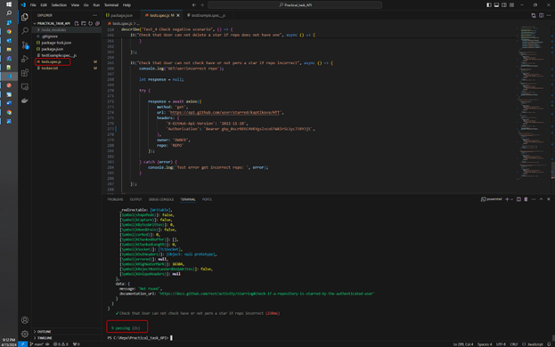

# Practical Task
## Contents
- [Тесты API](#api-test)
    - [Выбор framework](#test-framework)
- [Приложения](#applications)
    - [Скриншот о выполненных API тестах](#applications-api)

## <a name="#api-test">Тесты API</a>
- [Ссылка на репозиторий](https://github.com/kaptikova/Practical_task_API)
- [Файл с тестами](./tests.spec.js)


### <a name="#test-framework">Выбор framework</a>
Для выполнения API тестов я выбрала HTTP client Axios для браузера и node.js (library: Chai JS, Reporter: Mochawesome).
Свой выбор объясняю тем, что клиент бесплатный, легко устанавливается, поддерживает такие возможности как: 
- Создание http запросов, поддержвает Promise API
- преобразовывает данные запроса и ответа
- возможность отменять запросы
- автоматически приобразовывает даныне в JSON. 

Установка Axios:

1. Инициализируйте git-репо
```
git init
```
2. Инициализируйте проект узла
```
npm init -y
```
3. Выполните команду для установки всех необходимых зависимостей:
```
npm i axios mocha chai mochawesome
```
Выполнение тестов запускается командой:
```
npm test
```
Тесты содержатся в файле tests.spec.js


## <a name="#applications">Приложения</a>

### <a name="#applications-api">Скриншот о выполненных API тестах</a>
